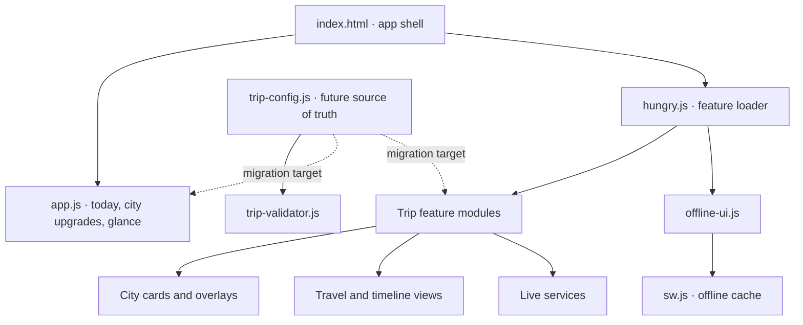

# Reusable Trip Dashboard Site Map

This file is the required starting point for every content or feature change. It maps the current China implementation and the intended reusable-trip architecture.

## Change workflow

1. Identify the fact or feature being changed.
2. Use the impact matrix below to find every producer, renderer, summary and cache entry.
3. Search the entire repository for both the old value and related labels.
4. Update the canonical data and every remaining legacy duplicate.
5. Bump all affected loader query versions plus `offline-ui.js` and `sw.js` when cached assets change.
6. Run JavaScript syntax checks, `git diff --check`, and a repository-wide stale-value search.
7. Publish, then verify the visible card, expanded detail, day-at-a-glance view, Travel view and offline refresh behavior.

No update is complete merely because one visible location changed.

## Runtime map

## Module inventory

| File | Responsibility | Trip-specific data | Update coupling |
| --- | --- | --- | --- |
| `index.html` | App shell, city cards, base Travel panel, photo spots | Yes, extensive legacy data | Cache-bust `app.js`/`hungry.js`; update duplicate visible content |
| `app.js` | Today card, city enhancements, hotels, day-at-a-glance | Yes | Dates, cities, hotels and transport summaries |
| `hungry.js` | Nearby restaurant UI and dynamic module loader | Mostly reusable | Bump query version for every changed loaded module |
| `day-adventures.js` | City day-card overrides and expanded “Explore this day” content | Yes | Day titles, routes, logistics, seats, gates and notes |
| `travel-details.js` | Detailed flight/train/hotel Travel cards | Yes | All confirmed transport and lodging changes |
| `overall-timeline.js` | Full-trip chronological timeline | Yes | Every dated itinerary or transport change |
| `trip-config.js` | Canonical reusable trip data under migration | Yes; intended source of truth | Update first; compare all legacy modules against it |
| `trip-validator.js` | Validates reusable configuration | Reusable | Run whenever `trip-config.js` changes |
| `gay-nightlife.js` | LGBTQ+ nightlife additions by city | Yes | City IDs, venues and current links |
| `weather.js` | Weather UI and city-to-endpoint mapping | City mapping | Route/city changes |
| `api/weather.js` | Live weather service coordinates | City mapping | Route/city changes |
| `hungry.js` + `api/restaurants.js` | GPS restaurant finder | Reusable service | API or UI changes |
| `spas.js` + `api/spas.js` | Spa discovery/details | Partly city-specific | Destination and venue changes |
| `chengdu-spa.js` | Chengdu spa guide | China-specific | Replace or omit for other trips |
| `translate.js` | Translation utility | Mostly reusable | Destination language changes |
| `suits.js` | Tailoring guide | Optional trip feature | Include only where relevant |
| `offline-ui.js` | Refresh button, offline status and worker registration | Reusable | Keep build ID synchronized with `sw.js` |
| `sw.js` | Precache manifest and fetch strategy | Reusable with module list | Add/remove modules and bump `VERSION` on releases |
| `manifest.webmanifest` | Installed-app identity | Trip-specific branding | New trip name, icon, theme and start URL |
| `app.css` | Shared presentation system | Reusable | New components or layout changes |

## Data impact matrix

| Change type | Required inspection targets |
| --- | --- |
| Train, flight or transfer | `trip-config.js`, `index.html`, `app.js` Today/glance data, `day-adventures.js` day details + visible overrides, `travel-details.js`, `overall-timeline.js` |
| Hotel | `trip-config.js`, `index.html`, `app.js` hotel cards, `day-adventures.js`, `travel-details.js`, `overall-timeline.js` |
| Day itinerary | `trip-config.js`, base city card in `index.html`, `app.js` Today/glance data, `day-adventures.js`, `overall-timeline.js` |
| City/route | All trip-data modules, weather mappings/endpoints, nightlife, spas, translation settings, photo spots, manifest branding |
| Feature module | `hungry.js` loader, `sw.js` `CORE_FILES`, affected CSS, offline build/version identifiers |
| Any cached content | Loader query version, `offline-ui.js` `BUILD`, `sw.js` `VERSION`, then installed-PWA refresh verification |

## Transport verification example

For a confirmed train, verify that every surface agrees on:

- Date and route
- Station names
- Departure and arrival times
- Train number
- Class
- Carriage and seats
- Checkpoint/gate
- “Today” summary
- City day card
- Expanded day details
- Press-and-hold day-at-a-glance
- Travel details
- Overall timeline
- Offline-cached copy

## Interchangeable-trip target

The finished architecture must render all trip-specific content from `trip-config.js` (or a future structured equivalent). Legacy hard-coded facts in `index.html`, `app.js`, `day-adventures.js`, `travel-details.js` and `overall-timeline.js` are temporary migration debt. New trip creation should eventually require only:

1. A new validated trip configuration.
2. Optional destination-specific feature modules.
3. Trip branding assets.
4. A build/version update and verification pass.

Until that migration is complete, this site map and impact matrix are mandatory safeguards against partial updates.
